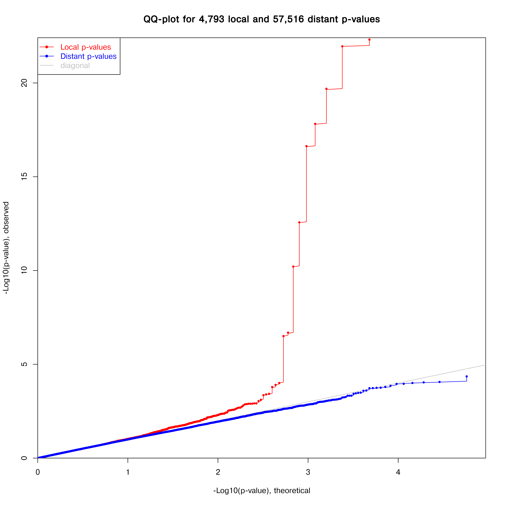

% mQTLs in Cartilage
% Andrew Skelton
% 21st June 2017

Some Target SNPs
--------------------
* Starting with 16 SNPs from John
* 5 Were present on the array
  * rs6766414, rs4867568, rs788748, rs11780978, rs10116772
* 8 Matched on LD (using LDLink from NIH)
  * `>`.7 LD + Within 1MB
* 3 Were not matched

LD Matched Missing SNPs
--------------------
--------------------------------------
  SNP_in    Replacement   Diff    R2
---------- ------------- ------ ------
rs4764133   rs11614333    368   0.9457
rs3850251    rs4383836    7347  0.8121
 rs754106    rs9534442   45099  0.8548
rs2862851    rs1807968    4541  0.9198
rs10471753   rs6893396    632     1
 rs496547    rs598373    87914  0.7818
rs2521349    rs2521348    3784  0.9835
rs2820436    rs2605096    1220    1
--------------------------------------

Analysis Process
--------------------
* Take input SNPs and subset genotype data (dim 13x88)
* Subset Methylation data for 1MB span of SNPs (dim 4793x88)
* Run MatrixEQTL with Sex, Age, and SampleType as Covariates
* Significance considered at FDR`<`0.05

Results
--------------------
* 10 Significant CpG SNP Pairs
* 4,793 Cis Tests

QQ Plot
--------------------

mQTL PLEC1;PIK3R1
--------------------

mQTL PLEC1;PIK3R1
--------------------

